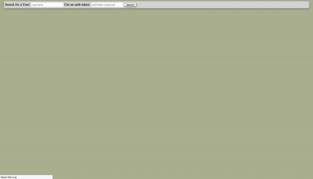
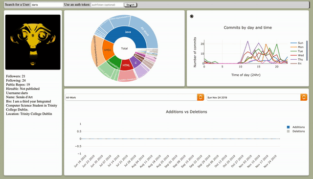
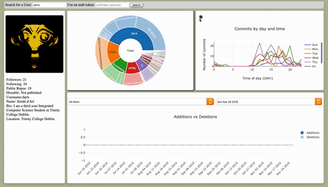
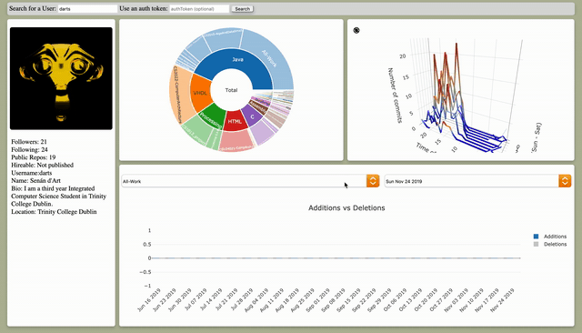

# Github Access Project

The code in this repo aims to provide more functionality to the user by providing insights into data gathered from a user.  

The code runs entirely in the browser (https://darts.github.io/CSU33012-SoftwareEngineering-Github-Data-Vis/actual/index.html). The user can search for a particular GitHub user's statistics. To do this they simply type a username into the search bar.   
  

If the user wishes they can use an access token to allow for more requests per hour.  

Some miscellaneous user data is displayed on the left-hand side of the screen eg. username, display name, bio, etc.  

A detailed breakdown of Lines of Code per language and repo is provided with a sunburst chart. This chart is clickable so a clearer view of the user's work can be seen for any given language.
  

A user's commit can be seen broken down by day, time and amount. This data is presented as both a 2D and 3D chart.
  

A view of the user's 'churn' can be seen at the bottom of the page. If a repo is selected, the last 24 week of commit amounts are shown (in LOC added and LOC deleted). The date can be selected as can the repo.
  

The following is a longer demonstration on a much larger piece of data. Please note that this was recorded on my personal machine which is a weak laptop (2013 single core, 2 thread) as that was all that was available to me, the ~30 seconds it takes to load the `linux` graph is ~4 seconds on the college lab computers.

